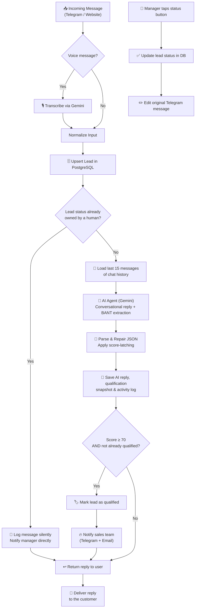

# 🤖 AI Lead Qualification Agent

**An autonomous, AI-powered lead qualification system for Telegram (and beyond) — built on n8n.**

The agent talks to inbound leads in natural language, qualifies them against the **BANT** framework (Budget, Authority, Need, Timeline), scores and categorizes them in real time, and instantly alerts your sales team the moment a lead goes 🔥 *Hot* — all without a human lifting a finger.

<p align="left">
  
  
  
  
  
</p>

---

## 📌 Overview

Most inbound leads are lost not because they weren't interested, but because nobody replied to them **fast enough, consistently enough, or intelligently enough**.

This agent solves that by acting as a tireless, always-on pre-sales consultant that:

- Responds to every incoming message — text or voice — within seconds, 24/7
- Conducts a natural, human-like qualifying conversation instead of a rigid form
- Extracts structured **BANT** data (Budget, Authority, Need, Timeline) from free-form conversation
- Detects customer sentiment (positive, neutral, frustrated, urgent) to help managers prioritize
- Hands off a fully qualified, scored lead to a human — with full context — exactly when it matters

The result: sales managers spend their time closing warm conversations instead of chasing cold ones.

---

## ✨ Key Features

- 💬 **Omnichannel intake** — accepts both **text and voice messages** (voice is transcribed automatically before processing)
- 🎯 **BANT-based qualification** — deterministic scoring engine (Budget 25 pts / Authority 20 pts / Need 30 pts / Timeline 25 pts) built on top of AI-extracted signals
- 🧠 **Sentiment & intent analysis** — classifies each message as `positive`, `neutral`, `frustrated`, or `urgent`
- 🗄️ **Automatic persistence** — every message, score, and qualification snapshot is saved to **PostgreSQL**
- 🔔 **Instant hot-lead alerts** — sends a real-time Telegram notification (with inline action buttons) *and* an email the moment a lead crosses the qualification threshold
- 🧷 **Score latching** — a lead's score never decreases once earned, preventing "downgrades" mid-conversation
- 🛡️ **Spam & abuse protection** — input validation, honeypot fields, and token-based auth on external-facing channels
- 🔁 **Manager-in-the-loop workflow** — one-tap status updates (`In Progress`, `Call Scheduled`, `Rejected`) directly from Telegram, synced back to the database
- 📇 **Contact capture** — smartly requests the customer's phone number only when a lead is qualified as hot and no contact is on file yet

---

## 🏗️ Architecture & Tech Stack

The system follows a **hub-and-satellite** pattern: lightweight *satellite* workflows normalize input from each channel, while a single *core* workflow owns all AI reasoning, scoring, and persistence logic.

| Layer | Technology | Responsibility |
|---|---|---|
| **Automation / Orchestration** | [n8n](https://n8n.io) (self-hosted) | Workflow orchestration, routing, business logic |
| **Channels** | Telegram Bot API, Website Webhook | Lead intake across multiple entry points |
| **Database** | PostgreSQL | Leads, chat history, qualification snapshots, activity log |
| **AI / LLM** | Google Gemini (2.5 Flash) via LangChain nodes, OpenRouter-compatible | Conversation, BANT extraction, sentiment analysis, voice transcription |
| **Logic Layer** | JavaScript (n8n Code nodes) | Deterministic scoring, validation, JSON parsing/repair, sanitation |
| **Notifications** | Telegram, Gmail | Real-time hot-lead alerts to the sales team |

### Design principle: AI proposes, code disposes

The LLM is deliberately kept **out of the critical path for decisions and money**. It is only responsible for:

- Holding a natural conversation
- Extracting BANT parameters *the customer has explicitly stated*
- Estimating a score and sentiment for the current turn

All **scoring math, category thresholds, status transitions, and database writes are handled by deterministic code and SQL** — never by the model. This keeps qualification consistent, auditable, and immune to LLM hallucination (e.g., the agent is explicitly forbidden from inventing budgets, timelines, or decision-maker status that weren't stated by the user).

---

## 🔄 Workflow & Business Logic

**End-to-end flow, from first contact to sales handoff:**

1. **Intake** — A satellite workflow (Telegram / Website) receives the message, validates/authenticates it, and normalizes it into a common schema
2. **Voice handling** — If the message is a voice note, it is transcribed via Gemini before continuing
3. **Lead upsert** — The Core Agent finds-or-creates the lead record in PostgreSQL and loads its current score
4. **Status short-circuit** — If the lead is already `in_progress`, `call_scheduled`, or `rejected`, the message is silently logged and routed to the human manager instead of the AI (to avoid the bot re-engaging an already-owned conversation)
5. **Context building** — The last 15 messages of conversation history are pulled and formatted for the LLM
6. **AI reasoning** — The AI Agent (Gemini) replies conversationally, advances the BANT conversation by one question at a time, and returns a strict JSON payload (reply, score, category, sentiment, reasoning, BANT fields)
7. **Parsing & repair** — A dedicated code node robustly parses the model's JSON (stripping any stray reasoning tokens) and applies the **score-latching** rule
8. **Persistence** — The AI's reply, the qualification snapshot, and an activity log entry are all written to PostgreSQL
9. **Qualification check** — If the score crosses the **Hot** threshold (≥ 70) and the lead isn't already being handled, the lead is marked `qualified`
10. **Sales handoff** — The sales team is notified instantly via **Telegram** (with inline action buttons) and **email**, including the full BANT summary
11. **Manager actions** — A manager can tap **In Progress / Call Scheduled / Rejected** directly in Telegram; the status is written back to PostgreSQL and the message is updated in place



---

## 🗃️ Database Schema

All data lives in a dedicated `lead_qualification` schema in PostgreSQL.

| Table | Purpose |
|---|---|
| `channels` | Reference table of supported intake channels (e.g. `telegram`, `website`) |
| `leads` | One row per unique lead — identity, contact info, current `status`, running `score`, metadata |
| `chat_histories` | Full conversational log per lead (`user` / `model` turns), used to reconstruct context for the AI |
| `lead_qualifications` | Historical snapshot of every scoring pass — score, category, BANT data, AI reasoning summary |
| `lead_activities` | Audit trail of system events (e.g. `ai_qualified`) for reporting and traceability |

**Lead status lifecycle:**

```
new → qualified → in_progress → call_scheduled
                              ↘ rejected
```

> `status` transitions are driven both automatically (AI qualification crossing the Hot threshold) and manually (sales manager actions via Telegram inline buttons).

---

## ⚙️ Setup & Security

### Prerequisites

- A running [n8n](https://n8n.io) instance (self-hosted recommended)
- A PostgreSQL database with the `lead_qualification` schema provisioned
- A Telegram bot token ([@BotFather](https://t.me/BotFather))
- A Google Gemini API key (or an OpenRouter-compatible key, if using an alternate LLM provider)
- (Optional) A Gmail account for email notifications

### Environment variables

Configure the following as n8n credentials / environment variables — **never commit real values to version control**:

```env
# PostgreSQL
POSTGRES_HOST=
POSTGRES_PORT=5432
POSTGRES_DB=
POSTGRES_USER=
POSTGRES_PASSWORD=

# Telegram
TELEGRAM_BOT_TOKEN=
SALES_TEAM_CHAT_ID=

# AI Provider
GOOGLE_GEMINI_API_KEY=
# or, alternatively:
OPENROUTER_API_KEY=

# Website intake webhook
WEBSITE_WEBHOOK_SECRET=

# Email notifications (optional)
GMAIL_OAUTH_CLIENT_ID=
GMAIL_OAUTH_CLIENT_SECRET=
```

### 🔐 Security notes

- All secrets are stored as **n8n credentials**, never hard-coded into workflow JSON
- The website intake endpoint is protected by a **shared-secret token** (`X-Website-Token` header) plus **honeypot field** spam detection
- Incoming website payloads are validated (email/phone format, message length) before being processed
- The AI is explicitly instructed never to fabricate budgets, timelines, or decision-maker authority — only confirmed, user-stated facts are scored
- `.env` files, credential exports, and any workflow JSON containing live tokens should be added to `.gitignore` and excluded from version control

### 🚀 Quick start

1. Import the workflow files into your n8n instance:
   - `[Core] Lead Qualification Agent.json`
   - `[Satellite] Telegram Input.json`
   - `[Satellite] Website Input.json` *(optional, for web form intake)*
2. Provision the PostgreSQL schema and tables described in [Database Schema](#-database-schema)
3. Configure all credentials listed above in n8n's credential manager
4. Set your sales team's Telegram chat ID for hot-lead alerts
5. Activate all three workflows
6. Send a test message to your bot and confirm a lead record appears in PostgreSQL 🎉

---

<p align="center">Built with ❤️ using n8n, PostgreSQL, and Google Gemini</p>
